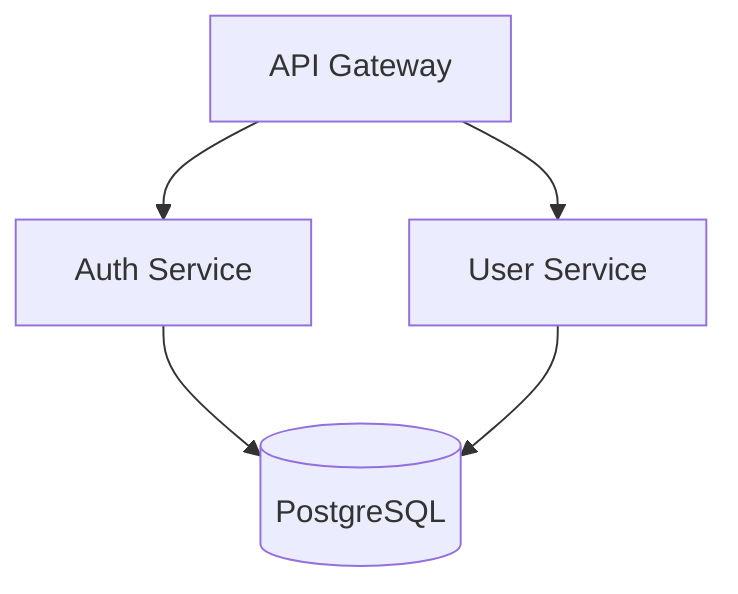

# 資深架構師 (Senior Architect)

為了做出明智技術決策的一套系統架構設計與分析工具套件。

## 目錄 (Table of Contents)

- [快速開始 (Quick Start)](#quick-start)
- [工具總覽 (Tools Overview)](#tools-overview)
  - [1. 架構圖生成器 (Architecture Diagram Generator)](#1-architecture-diagram-generator)
  - [2. 相依性分析器 (Dependency Analyzer)](#2-dependency-analyzer)
  - [3. 專案架構師 (Project Architect)](#3-project-architect)
- [決策工作管線 (Decision Workflows)](#decision-workflows)
  - [資料庫的選擇 (Database Selection)](#database-selection-workflow)
  - [架構模式的選擇 (Architecture Pattern Selection)](#architecture-pattern-selection-workflow)
  - [單體 vs 微服務的決策 (Monolith vs Microservices)](#monolith-vs-microservices-decision)
- [參考文件 (Reference Documentation)](#reference-documentation)
- [技術堆疊涵蓋範圍 (Tech Stack Coverage)](#tech-stack-coverage)
- [常見命令 (Common Commands)](#common-commands)

---

## 快速開始 (Quick Start)

```bash
# 從專案中產生架構圖
python scripts/architecture_diagram_generator.py ./my-project --format mermaid

# 分析相依性以找出潛在問題
python scripts/dependency_analyzer.py ./my-project --output json

# 取得架構的詳細評估報告
python scripts/project_architect.py ./my-project --verbose
```

---

## 工具總覽 (Tools Overview)

### 1. 架構圖生成器 (Architecture Diagram Generator)

將專案目錄結構轉換並生成為各種格式的系統架構圖。

**解決的問題:** 「我需要將我們的系統架構視覺化，以便放入文件或是與團隊討論」

**輸入:** 專案目錄的路徑 (Project directory path)
**輸出:** 圖表的程式碼 (Mermaid, PlantUML, 或是 ASCII)

**支援的圖表類型:**
- `component` (組件圖) - 展現模組與它們之間的關聯性
- `layer` (分層圖) - 展現架構分層 (展示層、業務邏輯層、資料層等)
- `deployment` (部署圖) - 展現部署上的拓樸結構

**用法:**
```bash
# Mermaid 格式 (預設)
python scripts/architecture_diagram_generator.py ./project --format mermaid --type component

# PlantUML 格式
python scripts/architecture_diagram_generator.py ./project --format plantuml --type layer

# ASCII 格式 (友善終端機顯示)
python scripts/architecture_diagram_generator.py ./project --format ascii

# 儲存到特定檔案
python scripts/architecture_diagram_generator.py ./project -o architecture.md
```

**輸出範例 (Mermaid):**


---

### 2. 相依性分析器 (Dependency Analyzer)

分析專案中相依套件之間的耦合程度 (coupling)、循環依賴 (circular dependencies)，以及是否有過期的套件。

**解決的問題:** 「我需要了解當前套件的相依樹 (dependency tree)，並揪出可能的隱患」

**輸入:** 專案目錄的路徑 (Project directory path)
**輸出:** 分析報告 (JSON 或人類可讀的文字)

**分析項目涵蓋:**
- 相依套件樹狀圖 (直接與遞迴間接依賴)
- 模組之間的循環依賴 (Circular dependencies)
- 耦合程度評分 (Coupling score 0-100)
- 過期的相依套件 (Outdated packages)

**支援的套件管理器:**
- npm/yarn (`package.json`)
- Python (`requirements.txt`, `pyproject.toml`)
- Go (`go.mod`)
- Rust (`Cargo.toml`)

**用法:**
```bash
# 人類可讀的分析報告
python scripts/dependency_analyzer.py ./project

# 輸出成 JSON 格式以便與 CI/CD 整合
python scripts/dependency_analyzer.py ./project --output json

# 僅檢查是否存在循環依賴
python scripts/dependency_analyzer.py ./project --check circular

# 囉嗦模式：附上詳細的改善建議
python scripts/dependency_analyzer.py ./project --verbose
```

**輸出範例:**
```
Dependency Analysis Report
==========================
Total dependencies: 47 (32 direct, 15 transitive)
Coupling score: 72/100 (moderate)

Issues found:
- CIRCULAR: auth → user → permissions → auth
- OUTDATED: lodash 4.17.15 → 4.17.21 (security)

Recommendations:
1. Extract shared interface to break circular dependency
2. Update lodash to fix CVE-2020-8203
```

---

### 3. 專案架構師 (Project Architect)

自動分析專案目錄結構，並偵測其使用的架構模式、壞味道 (code smells)，以及可改善的空間。

**解決的問題:** 「我想了解這個專案目前的架構全貌，並找出該重構與改進的地方」

**輸入:** 專案目錄的路徑 (Project directory path)
**輸出:** 架構評估報告

**偵測項目涵蓋:**
- 架構模式 (MVC, 分層架構 layered, 六角形架構 hexagonal, 微服務的指標 microservices)
- 程式碼的組織問題 (上帝類別 God classes, 責任雜湊 mixed concerns)
- 越界的分層違規 (Layer violations)
- 遺失的關鍵架構組件

**用法:**
```bash
# 完整評估
python scripts/project_architect.py ./project

# 囉嗦模式：附上詳細的改善與重構建議
python scripts/project_architect.py ./project --verbose

# JSON 輸出
python scripts/project_architect.py ./project --output json

# 僅檢查特定的區塊 (例如查核階層)
python scripts/project_architect.py ./project --check layers
```

**輸出範例:**
```
Architecture Assessment
=======================
Detected pattern: Layered Architecture (confidence: 85%)

Structure analysis:
  ✓ controllers/  - Presentation layer detected
  ✓ services/     - Business logic layer detected
  ✓ repositories/ - Data access layer detected
  ⚠ models/       - Mixed domain and DTOs

Issues:
- LARGE FILE: UserService.ts (1,847 lines) - consider splitting
- MIXED CONCERNS: PaymentController contains business logic

Recommendations:
1. Split UserService into focused services
2. Move business logic from controllers to services
3. Separate domain models from DTOs
```

---

## 決策工作管線 (Decision Workflows)

### 選擇資料庫 (Database Selection Workflow)

在建置新專案或是要搬遷現有資料時，使用本指南選擇最合適的 DB。

**第一步：辨識資料特性 (Identify data characteristics)**
| 特性 | 指向 SQL 的指標 | 指向 NoSQL 的指標 |
|----------------|---------------|-----------------|
| 結構化並含有資料關聯 (Relationships) | ✓ | |
| 必須擁有 ACID 交易管理特性 | ✓ | |
| 彈性 / 可漸進演化的結構 (Evolving schema) | | ✓ |
| 文件導向的資料 (Document-oriented data) | | ✓ |
| 時間序列的資料 (Time-series data) | | ✓ (或專門的 TS DB) |

**第二步：評估擴展性需求 (Evaluate scale requirements)**
- < 100 萬筆紀錄, 單一區域部署 → PostgreSQL 或是 MySQL
- 100 萬-1億筆紀錄, 讀取佔重度比例 → PostgreSQL 搭配讀取副本 (Read replicas)
- > 1 億筆紀錄, 全球分散式部署 → CockroachDB, Spanner, 或是 DynamoDB
- 超高負載的寫入吞吐量 (>10K/sec) → Cassandra 或是 ScyllaDB

**第三步：檢查一致性需求 (Check consistency requirements)**
- 需要強一致性 (Strong consistency) → SQL 或是 CockroachDB
- 最終一致性 (Eventual consistency) 可被接受 → DynamoDB, Cassandra, MongoDB

**第四步：紀錄決策 (Document decision)**
建立一份 ADR (Architecture Decision Record) 架構決策紀錄，內容須包含：
- 背景脈絡與系統需求
- 列入考量的選項比較
- 選定的結論與合理推論
- 我們接受了什麼樣的折衷 (Trade-offs accepted)

**快速參考標準:**
```
PostgreSQL   → 絕大多數應用的「預設與首選」
MongoDB      → Document store, 彈性的資料格式
Redis        → Caching (快取), 會話管理 (sessions), 即時功能
DynamoDB     → Serverless, auto-scaling 自動擴展, AWS 原生整合
TimescaleDB  → 將時間序列資料封裝為 SQL 介面
```

---

### 選擇架構模式 (Architecture Pattern Selection Workflow)

在建置新專案或重新設計舊系統架構時使用。

**第一步：評估團隊與專案規模 (Assess team and project size)**
| 團隊大小 | 建議的起始架構點 |
|-----------|---------------------------|
| 1-3 位開發人員 | 模組化單體架構 (Modular monolith) |
| 4-10 位開發人員| 模組化單體，或是基礎的面向服務 (SOA) |
| 10+ 位開發人員 | 將微服務架構 (Microservices) 納入考量 |

**第二步：評估部署需求 (Evaluate deployment requirements)**
- 可以接受一次將整個大禮包打包部署 → 單體架構 (Monolith)
- 需要多個節點獨立進行擴充 (Independent scaling) → 微服務架構 (Microservices)
- 混合需求 (只有少數幾個服務具備獨立擴展需求) → 混合式架構 (Hybrid)

**第三步：評估資料邊界 (Consider data boundaries)**
- 資料庫共用不構成問題 → 單體架構 或是 模組化單體架構
- 需要嚴格的資料隔離 (Strict data isolation) → 各自擁有不流通 DB 的微服務
- 適合依靠實時事件觸發溝通 → 事件驅動型架構 (Event-sourcing/CQRS)

**第四步：對接需求與模式 (Match pattern to requirements)**

| 您的需求 | 建議的架構模式 |
|-------------|-------------------|
| 要求快速產出 MVP 最小可行性產品 | Modular Monolith (模組化單體架構) |
| 各個團隊要求完全獨立與隔離的部署循環 | Microservices (微服務架構) |
| 處理極端複雜的商業領域邏輯 | Domain-Driven Design (領域驅動設計 DDD) |
| 讀取與寫入兩端的吞吐量有著懸殊落差 | CQRS |
| 需要極為嚴謹的竄改控制與稽核追蹤 (Audit trail) | Event Sourcing (事件溯源) |
| 外部第三方的串接替換極為頻繁 | Hexagonal (六角形架構) / Ports & Adapters |

請參閱 `references/architecture_patterns.md` 以取得上述模式更深入的解說。

---

### 單體 vs 微服務的抉擇 (Monolith vs Microservices Decision)

**請選擇 Monolith (單體架構) 若你符合：**
- [ ] 開發團隊規模很小 (<10 位開發人員)
- [ ] 當前系統的「領域邊界 (Domain boundaries)」還不明確
- [ ] 高速迭代 (Rapid iteration) 是當前的第一要務
- [ ] 必須將「營運維護 (Operational)」的複雜度降到最低
- [ ] 大家共用一顆資料庫是不成問題的

**請選擇 Microservices (微服務架構) 若你符合：**
- [ ] 團隊能獨立擁有且負責單一微服務的端到端 (end-to-end) 開發生死
- [ ] 系統的「獨立部署 (Independent deployment)」能創造營收上決定性的關鍵
- [ ] 不同組件之間有著「懸殊的垂直擴展與吞吐量需求」
- [ ] 系統中非常需要混用各懷絕技的程式語言與技術 (Technology diversity)
- [ ] 「領域邊界 (Domain boundaries)」已經被切得極為透澈

**混合式破局策略 (Hybrid approach):**
一律從「模組化單體架構 (Modular monolith)」作為開發起點。只有在以下情形發生時，才將服務抽離出來：
1. 這個模組的擴展與負載需求突然變得和其他人完全不一樣。
2. 負責這個模組的特定團隊要求要擁有獨立部署的能力。
3. 受限於舊框架效能瓶頸，需要導入新的技術來將其隔離。

---

## 參考文件 (Reference Documentation)

載入下列檔案以獲取更詳細的工作指南：

| 檔案名稱 | 內容包含 | 什麼時候要呼叫 |
|------|----------|--------------------------|
| `references/architecture_patterns.md` | 9 大軟體架構模式及其優缺點權衡、程式碼範例與應用場景 | 當使用者問 "which pattern?", "microservices vs monolith", "event-driven", "CQRS" 時 |
| `references/system_design_workflows.md` | 用於解決系統設計與規劃任務的 6 階段流程拆解步驟 | 當使用者問 "how to design?", "capacity planning", "API design", "migration" 時 |
| `references/tech_decision_guide.md` | 技術選擇框架的比較與決策矩陣指南 | 當使用者問 "which database?", "which framework?", "which cloud?", "which cache?" 時 |

---

## 技術堆疊涵蓋範圍 (Tech Stack Coverage)

**支援語言:** TypeScript, JavaScript, Python, Go, Swift, Kotlin, Rust
**前端:** React, Next.js, Vue, Angular, React Native, Flutter
**後端:** Node.js, Express, FastAPI, Go, GraphQL, REST
**資料庫:** PostgreSQL, MySQL, MongoDB, Redis, DynamoDB, Cassandra
**基礎設施:** Docker, Kubernetes, Terraform, AWS, GCP, Azure
**CI/CD:** GitHub Actions, GitLab CI, CircleCI, Jenkins

---

## 常見的互動指令 (Common Commands)

```bash
# 架構視覺化
python scripts/architecture_diagram_generator.py . --format mermaid
python scripts/architecture_diagram_generator.py . --format plantuml
python scripts/architecture_diagram_generator.py . --format ascii

# 相依套件分析與問題檢測
python scripts/dependency_analyzer.py . --verbose
python scripts/dependency_analyzer.py . --check circular
python scripts/dependency_analyzer.py . --output json

# 自動化架構評估
python scripts/project_architect.py . --verbose
python scripts/project_architect.py . --check layers
python scripts/project_architect.py . --output json
```

---

## 獲取說明 (Getting Help)

1. 在執行任何 python script 時加上 `--help` 以取得使用指令說明
2. 參考 Reference files 以深入了解背後的架構哲學與設計原理
3. 使用 `--verbose` 旗標以取得更豐富的重構與改善建議
